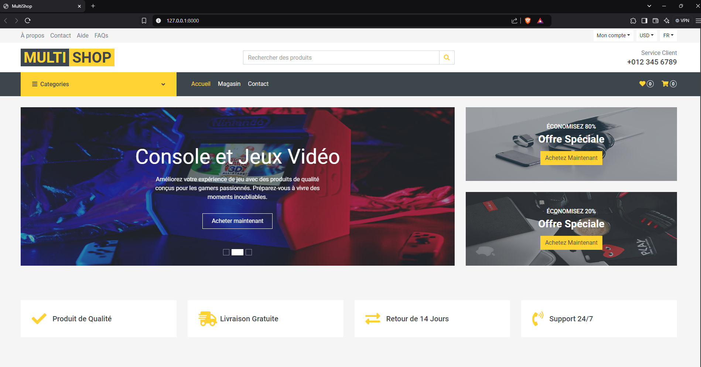
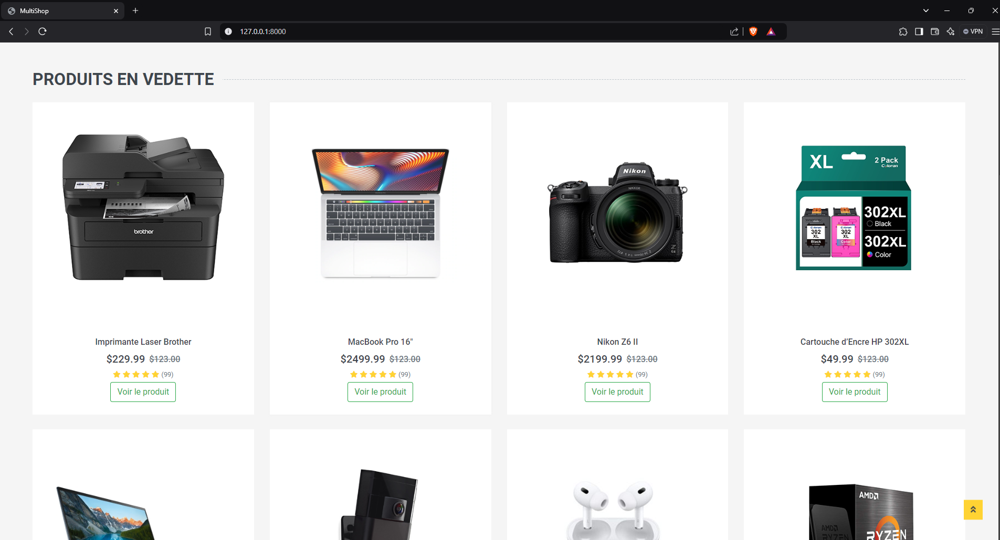
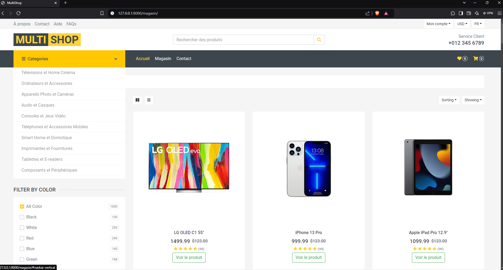
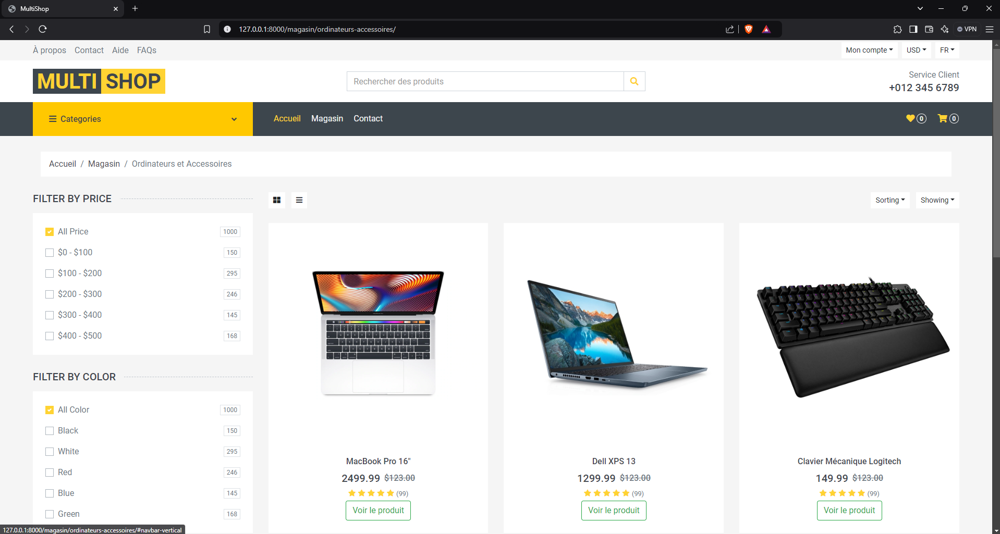
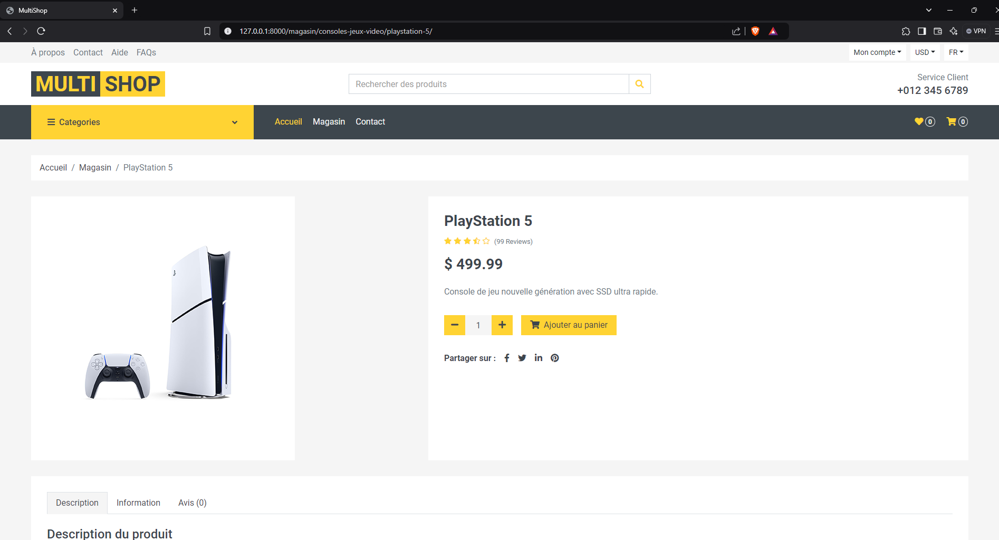

# Multishop eCommerce Platform
An eCommerce web application built with Django, designed for multimedia products like phones, shoes, computers, and more. Inspired by platforms like Amazon and Best Buy. Currently updating fontionalities

## Features
- Product catalog with categories
- Dynamic homepage displaying featured and recent products
- Admin dashboard for managing products, categories, and orders
- Responsive design for all device types

## Home Page


## Featured products


## Category menu list


## Products (cat: Ordinateur et accessoires)


## Product details


## 🛠️ Installation
1. Clone the repository:
 ``` bash
git clone https://github.com/Lil-Code30/django-ecommerce.git
```
2. Navigate to the project directory:
 ``` bash
cd django-ecommerce
```
3. Create a virtual environment (optional but recommended):
 ``` bash
python -m venv venv
source venv/bin/activate  # On Windows, use `venv\Scripts\activate`
```
4. Install dependencies:
 ``` bash
pip install -r requirements.txt
```
5. Run database migrations:
 ``` bash
python manage.py migrate
```
6. Create a superuser (for the Django admin):
 ``` bash
python manage.py createsuperuser
```
